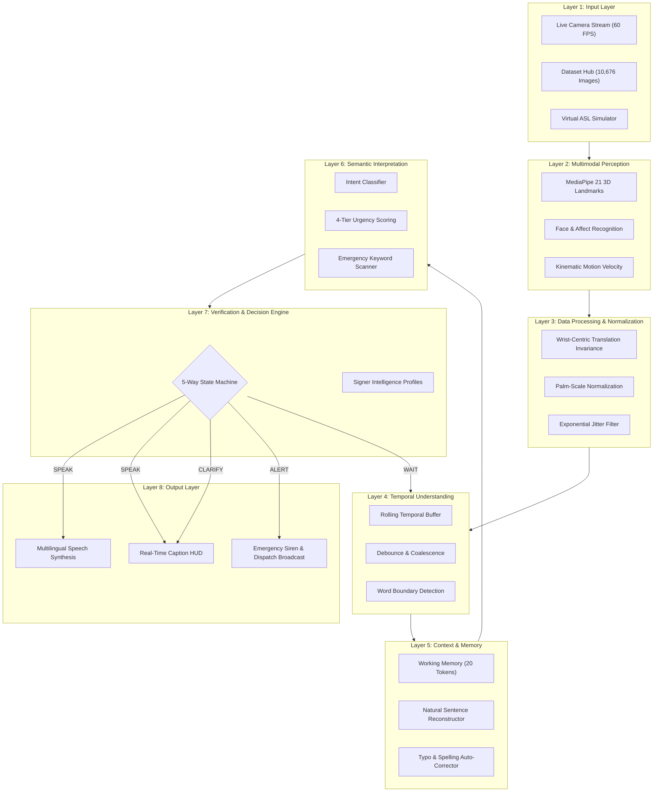

# 🌐 VoxSign AI Copilot — Sign Language to Multilingual Speech Engine

<div align="center">

[](https://www.python.org/)
[](https://fastapi.tiangolo.com/)
[](https://scikit-learn.org/)
[](https://developers.google.com/mediapipe)
[](#-model--dataset-benchmarks)
[](LICENSE)
[](#-quick-start)

**A real-time, context-aware multimodal AI copilot that translates American Sign Language (ASL) into grammatically fluent, natural spoken speech across 12+ international languages.**

[Key Features](#-key-features) • [System Architecture](#-8-layer-system-architecture) • [Quick Start](#-quick-start) • [API Reference](#-api-reference) • [Signer Intelligence](#-signer-intelligence-profiles) • [Dataset & Benchmarks](#-model--dataset-benchmarks)

</div>

---

## 📖 Overview

**VoxSign AI Copilot** bridges the communication divide between the Deaf/Hard-of-Hearing community and the hearing world. Rather than offering basic, rigid letter-by-letter spelling, VoxSign functions as a **complete multimodal intelligence pipeline**:

1. **Tracks 21 3D hand landmarks in real time (60 FPS)** using MediaPipe.
2. **Predicts ASL alphabet signs with 98.85% test accuracy** through an optimized Multi-Layer Perceptron (MLP) neural network.
3. **Decides when to speak, wait, clarify, self-correct, or raise emergency alarms** via an intelligent 5-way decision state machine.
4. **Reconstructs isolated fingerspelled tokens into polite, grammatically fluent conversational sentences** using a built-in context NLP engine.
5. **Synthesizes real-time natural speech** in 12+ international languages (English, Spanish, French, German, Hindi, Japanese, Chinese, Arabic, Telugu, Tamil, and Italian).
6. **Protects users in emergencies** through instant SOS keywords (`HELP`, `PAIN`, `FIRE`, `CHOKING`, `HOSPITAL`, `ACCIDENT`) with high-priority audio sirens and visual dispatch strobes.

---

## 🌟 Key Features

### 👁️ 1. Real-Time Multimodal Perception (60 FPS)
- **21 3D Landmark Tracking**: Sub-millimeter spatial tracking across wrist, thumb, index, middle, ring, and pinky joints.
- **Biometric & Kinematic Telemetry**: Live calculation of palm tilt angle, pinch distance, optical velocity, and facial emotion/affect.
- **Dual Camera Modes**: Support for live WebRTC webcam feeds, mirror flipping, or built-in gesture stream simulations.

### 🧠 2. 5-Way AI Decision State Machine
Traditional sign recognition tools spam audio on every frame. VoxSign's **Decision Engine** arbitrates five distinct actions:
| Action | State Color | Trigger Condition | System Behavior |
|---|---|---|---|
| **SPEAK** | 🟢 Emerald | Confidence $\ge$ threshold & Hold duration met | Synthesizes natural fluent sentence |
| **WAIT** | 🔵 Cyan / Gray | Dynamic gesture transition or hold timer running | Buffers frames; filters motion jitter |
| **CLARIFY** | 🟡 Amber | Ambiguous confidence ($45\% \le \text{Conf} < 75\%$) | Suggests top-3 candidate signs |
| **CORRECT** | 🟣 Purple | Subsequent signs alter linguistic context | Retroactively amends previous interpretations |
| **ALERT** | 🔴 Crimson | Emergency keyword detected (`HELP`, `PAIN`, etc.) | Triggers audible siren & emergency strobe |

### 🔤 3. Context NLP Engine & Self-Correction
- **Intelligent Debouncing**: Eliminates duplicate tokens during continuous holds without dropping legitimate double letters.
- **Typo Auto-Correction**: Corrects common fingerspelling slips (e.g., `HLP` $\rightarrow$ `HELP`, `WATR` $\rightarrow$ `WATER`, `THX` $\rightarrow$ `THANKS`).
- **Contextual Sentence Generation**: Expands isolated words into natural conversational statements (e.g., `WATER` $\rightarrow$ *"May I please have a glass of water?"*).
- **Working Conversational Memory**: Retains the last 20 signs and historical dialogue context to maintain multi-turn coherence.

### ♿ 4. Personalized Signer Intelligence
Customizable to each signer's motor proficiency and pace:
- **Standard / Balanced**: Default profile for balanced daily conversation speed and accuracy.
- **Fast Signer (Fluent)**: Low latency (200ms hold, 150ms debounce) for rapid, experienced signers.
- **Novice / Learning**: Higher confidence requirements and longer hold duration (600ms) with proactive suggestions.
- **Tremor & Stability Assist**: Exponential smoothing jitter filter tailored for elderly individuals or users with motor tremors.

### 🗣️ 5. Real-Time Multilingual Speech Engine
- Real-time speech synthesis in **12+ languages**:
  - 🇺🇸 English (US) / 🇬🇧 English (UK)
  - 🇪🇸 Spanish (Español)
  - 🇫🇷 French (Français)
  - 🇩🇪 German (Deutsch)
  - 🇮🇳 Hindi (हिन्दी)
  - 🇯🇵 Japanese (日本語)
  - 🇨🇳 Mandarin Chinese (中文)
  - 🇸🇦 Arabic (العربية)
  - 🇮🇳 Telugu (తెలుగు)
  - 🇮🇳 Tamil (தமிழ்)
  - 🇮🇹 Italian (Italiano)
- Configurable voice acoustics: Speech Rate ($0.5\times$ to $2.0\times$) and Pitch modulation.

### 📊 6. Built-in Dataset Hub & Benchmark Lab
- Direct integration with **10,676 ASL alphabet images** across all 26 classes (A–Z).
- Interactive sample viewer with one-click model evaluation.
- Drag-and-drop testbed for external images to benchmark classifier performance on demand.

---

## 🏛️ 8-Layer System Architecture



---

## 🔬 Model & Dataset Benchmarks

The perception engine is powered by a high-capacity **Multi-Layer Perceptron (MLP)** neural network trained on a standardized ASL alphabet image dataset:

<div align="center">

| Metric | Specification |
|---|---|
| **Model Architecture** | Multi-Layer Perceptron (`hidden_layer_sizes=(256, 128)`) |
| **Activation Function** | ReLU |
| **Optimization Algorithm** | Adam (`early_stopping=True`, `n_iter_no_change=10`) |
| **Input Feature Vector** | $48 \times 48$ Grayscale Flattened Array ($2,304$ dimensions) |
| **Classes Trained** | **26 Classes** (`A` through `Z`) |
| **Total Dataset Size** | **10,676 Images** |
| **Test Set Accuracy** | **98.85%** |
| **Per-Frame Inference Latency** | **< 12 ms** on standard CPU |

</div>

---

## 📁 Repository Structure

```text
n9n-sign-language-copilot/
├── app.py                      # FastAPI server & REST API endpoints
├── train_model.py              # MLP classifier training script & data preprocessor
├── requirements.txt            # Python dependencies
├── engine/
│   ├── dataset_service.py      # Dataset indexing, sampling & local inference
│   ├── decision_engine.py     # 5-way decision state machine & signer profiles
│   └── nlp_engine.py           # Context NLP, emergency scanner & auto-correction
├── models/
│   ├── sign_classifier.joblib  # Trained scikit-learn MLP model (~7.5 MB)
│   └── model_metadata.json     # Class distribution, test accuracy & confusion matrix
└── static/
    ├── index.html              # Cyberpunk / glassmorphic single-page web app
    ├── style.css               # Design system, layout grid & animations
    ├── app.js                  # Main controller, event wiring & TTS synthesis
    ├── mediapipe_tracker.js    # MediaPipe 21 3D landmark camera pipeline
    ├── dataset_hub.js          # Dataset explorer & drag-and-drop benchmark UI
    └── architecture_visualizer.js # Interactive 3D 8-layer architecture explorer
```

---

## 🚀 Quick Start

### Prerequisites
- **Python 3.10+**
- A modern web browser (Google Chrome, Microsoft Edge, or Firefox) with webcam permissions enabled.

### 1. Clone Repository
```bash
git clone https://github.com/hara-99/n9n-sign-language-copilot.git
cd n9n-sign-language-copilot
```

### 2. Set Up Virtual Environment
```bash
# Windows
python -m venv .venv
.venv\Scripts\activate

# Linux / macOS
python3 -m venv .venv
source .venv/bin/activate
```

### 3. Install Dependencies
```bash
pip install -r requirements.txt
```

### 4. Launch the AI Copilot
```bash
python app.py
```
*The server starts locally at [http://127.0.0.1:8000](http://127.0.0.1:8000).*

Open your browser and navigate to `http://127.0.0.1:8000` to access the full web interface!

---

## 🛠️ Retraining the Model (Optional)

If you have downloaded a custom ASL dataset or updated the training set:

1. Update `DATASET_DIR` in `train_model.py`:
   ```python
   DATASET_DIR = r"path/to/your/asl/alphabet/Data"
   ```
2. Run the training pipeline:
   ```bash
   python train_model.py
   ```
3. The trained classifier will be exported to `models/sign_classifier.joblib` and metrics updated in `models/model_metadata.json`.

---

## 📡 API Reference

The FastAPI backend exposes comprehensive RESTful endpoints for integration into third-party clients, IoT devices, or mobile applications.

### 1. Perception & Inference
- **`POST /api/predict`**
  - **Body**: `{"image_b64": "data:image/jpeg;base64,..."}`
  - **Response**:
    ```json
    {
      "predicted_class": "A",
      "confidence": 0.9885,
      "top_candidates": [
        {"token": "A", "probability": 0.9885},
        {"token": "E", "probability": 0.0092},
        {"token": "S", "probability": 0.0015}
      ],
      "inference_time_ms": 11.4
    }
    ```

### 2. Decision Engine Evaluation
- **`POST /api/decision`**
  - **Body**:
    ```json
    {
      "token": "H",
      "confidence": 0.94,
      "hold_time_ms": 380,
      "is_emergency": false,
      "sentence_complete": false
    }
    ```
  - **Response**:
    ```json
    {
      "action": "SPEAK",
      "reason": "Sign 'H' validated with 94.0% confidence",
      "badge_color": "emerald",
      "token": "H",
      "confidence": 0.94,
      "should_vocalize": true,
      "should_sound_alarm": false
    }
    ```

### 3. Context NLP & Sentence Reconstruction
- **`POST /api/nlp/reconstruct`**
  - **Body**:
    ```json
    {
      "tokens": ["H", "E", "L", "P"]
    }
    ```
  - **Response**:
    ```json
    {
      "raw_text": "HELP",
      "cleaned_tokens": ["H", "E", "L", "P"],
      "synthesized_sentence": "Emergency! I need help immediately!",
      "intent": "EMERGENCY",
      "urgency": "EMERGENCY",
      "is_emergency": true,
      "action": "ALERT"
    }
    ```

### 4. Signer Profile Management
- **`POST /api/profile`**
  - **Body**:
    ```json
    {
      "profile_name": "tremor_assist",
      "confidence_threshold": 0.70,
      "hold_duration_ms": 500
    }
    ```

### 5. Dataset Statistics & Samples
- **`GET /api/status`** — Returns system telemetry, active profile, and model status.
- **`GET /api/dataset/stats`** — Returns total dataset images, per-class breakdown, and metadata.
- **`GET /api/dataset/sample/{class_name}`** — Returns a random base64 sample image for validation.

---

## 🎛️ Signer Intelligence Profiles

| Parameter | Balanced | Fast Signer | Novice | Tremor Assist |
|---|---|---|---|---|
| **Target Signer** | General Daily Use | Fluent / Rapid | Learners & Children | Motor Tremors / Elderly |
| **Confidence Threshold** | `75%` | `65%` | `82%` | `70%` |
| **Clarify Lower Bound** | `45%` | `40%` | `50%` | `40%` |
| **Hold Duration Target** | `350 ms` | `200 ms` | `600 ms` | `500 ms` |
| **Debounce Window** | `250 ms` | `150 ms` | `400 ms` | `450 ms` |
| **Tremor Filter** | Disabled | Disabled | Disabled | **Active (Exponential)** |

---

## 🧪 Built-in Virtual ASL Simulator

No webcam connected? Use the built-in **Virtual ASL Keyboard** located on the *Continuous Sequence & NLP* tab:
- Click or tap letters `A` through `Z` to inject tokens into the temporal buffer.
- Tap **Space** to commit words.
- Click quick emergency buttons (**"HELP"**, **"PAIN"**, **"FIRE"**, **"WATER"**, **"THANK YOU"**) to test the NLP reconstruction, 5-way state machine, and vocal synthesis immediately.

---

## 🛡️ Safety & Emergency Protocol

VoxSign incorporates a dedicated safety subsystem for vulnerable individuals in distress:
1. **Critical Keywords**: Any sign sequence matching `HELP`, `PAIN`, `DANGER`, `HOSPITAL`, `FIRE`, `CHOKING`, `POLICE`, `DOCTOR`, `MEDICINE`, `ACCIDENT`, or `BREATHE` immediately triggers state **`ALERT`**.
2. **Audio-Visual Strobe**: The UI triggers a pulsing crimson strobe overlay, sounds a high-frequency alerting tone, and vocalizes the synthesized distress phrase at maximum volume.
3. **One-Touch SOS**: The header provides an instant **🚨 SOS ALERT** button for manual triggering without delay.

---

## 🤝 Contributing

Contributions are warmly welcome! To contribute:
1. Fork the Project repository.
2. Create your Feature Branch (`git checkout -b feature/AmazingFeature`).
3. Commit your Changes (`git commit -m 'Add some AmazingFeature'`).
4. Push to the Branch (`git push origin feature/AmazingFeature`).
5. Open a Pull Request.

---

## 📄 License

Distributed under the **MIT License**. See `LICENSE` for more information.

---

<div align="center">
  <sub>Engineered with care for universal accessibility and seamless human communication.</sub>
</div>
